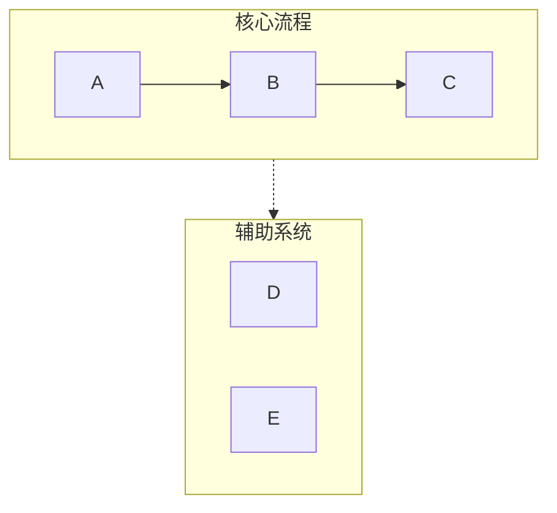
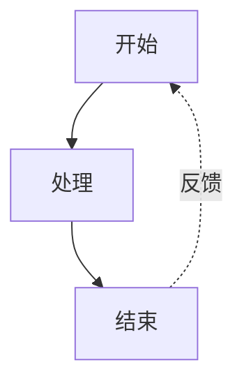
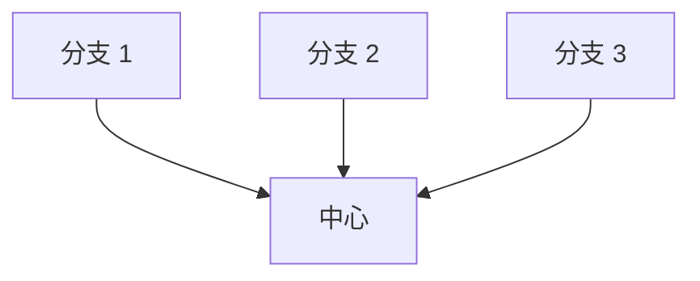

# Mermaid 可视化工具

## 概述

将文本内容转换为清晰、专业的 Mermaid 图表，适用于演示和文档。自动处理常见语法陷阱（列表语法冲突、subgraph 命名、间距问题），确保图表在 Obsidian、GitHub 及其他 Mermaid 兼容平台上正确渲染。

## 快速开始

创建 Mermaid 图表时：

1. **分析内容** — 识别关键概念、关系和流程
2. **选择图表类型** — 选择最合适的可视化形式（见下方图表类型）
3. **选择配置** — 确定布局、细节级别和样式
4. **生成图表** — 创建语法正确的 Mermaid 代码
5. **以 Markdown 输出** — 用正确的代码围栏包裹，可附带简要说明

**默认假设：**
- 垂直布局（TB），除非用户指定水平布局
- 中等细节级别（简洁与信息量的平衡）
- 专业配色方案，语义化颜色
- 兼容 Obsidian/GitHub 语法

## 图表类型

### 1. 流程图（graph TB/LR）
**最适用：** 工作流、决策树、顺序流程、AI Agent 架构

**使用场景：** 内容描述步骤、阶段或一系列操作

**关键特性：**
- 通过 subgraph 实现泳道分组
- 箭头标签标注流转
- 反馈循环与分支
- 颜色编码的阶段

**配置选项：**
- `layout`："vertical" (TB)、"horizontal" (LR)
- `detail`："simple"（仅核心步骤）、"standard"（含描述）、"detailed"（含注释）
- `style`："minimal"、"professional"、"colorful"

### 2. 循环流程图（graph TD 环形布局）
**最适用：** 循环过程、持续改进循环、Agent 反馈系统

**使用场景：** 内容强调迭代、反馈或循环关系

**关键特性：**
- 中心枢纽向外辐射
- 弧形反馈箭头
- 清晰的循环指示

### 3. 对比图（graph TB 平行路径）
**最适用：** 前后对比、A vs B 分析、传统与现代系统对比

**使用场景：** 内容对比两种或多种方案或系统

**关键特性：**
- 左右并排布局
- 中央对比节点
- 通过颜色/样式明确区分

### 4. 思维导图
**最适用：** 层级概念、知识组织、主题拆解

**使用场景：** 内容为层级结构，有明确的父子关系

**关键特性：**
- 放射状树形结构
- 多级嵌套
- 清晰的视觉层次

### 5. 时序图
**最适用：** 组件间交互、API 调用、消息流

**使用场景：** 内容涉及角色/系统间随时间的通信

**关键特性：**
- 基于时间线的布局
- 清晰的角色分离
- 进程激活框

### 6. 状态图
**最适用：** 系统状态、状态转换、生命周期阶段

**使用场景：** 内容描述状态及其之间的转换

**关键特性：**
- 清晰的状态节点
- 标注转换标签
- 起始和终止状态

## 关键语法规则

**务必遵循以下规则以避免解析错误：**

### 规则 1：避免列表语法冲突
```
❌ 错误：[1. Perception]       → 触发 "Unsupported markdown: list"
✅ 正确：[1.Perception]         → 去掉点号后的空格
✅ 正确：[① Perception]         → 使用带圈数字（①②③④⑤⑥⑦⑧⑨⑩）
✅ 正确：[(1) Perception]       → 使用括号
✅ 正确：[Step 1: Perception]   → 使用 "Step" 前缀
```

### 规则 2：Subgraph 命名
```
❌ 错误：subgraph AI Agent Core  → 名称含空格且未加引号
✅ 正确：subgraph agent["AI Agent Core"]  → 使用 ID 配合显示名
✅ 正确：subgraph agent          → 仅使用简单 ID
```

### 规则 3：节点引用
```
❌ 错误：Title --> AI Agent Core  → 直接引用显示名
✅ 正确：Title --> agent          → 引用 subgraph ID
```

### 规则 4：节点文本中的特殊字符
```
✅ 含空格的文本使用引号：["Text with spaces"]
✅ 引号替换：使用 『』 代替英文双引号
✅ 括号替换：使用 「」 代替英文括号
✅ 圆形节点内换行：((Text<br/>Break))
```

### 规则 5：箭头类型
- `-->` 实线箭头
- `-.->` 虚线箭头（用于辅助系统、可选路径）
- `==>` 粗箭头（用于强调）
- `~~~` 隐形链接（仅用于布局）

完整语法参考和边缘情况参见 [references/syntax-rules.md](references/syntax-rules.md)

## 配置选项

所有图表接受以下参数：

**布局：**
- `direction`："vertical" (TB)、"horizontal" (LR)、"right-to-left" (RL)、"bottom-to-top" (BT)
- `aspect`："portrait"（默认）、"landscape"（宽幅）、"square"

**细节级别：**
- `simple`：仅核心元素，最少标签
- `standard`：平衡细节与关键描述（默认）
- `detailed`：完整注释、说明和元数据
- `presentation`：针对幻灯片优化（大字号，少细节）

**样式：**
- `minimal`：单色，简洁线条
- `professional`：语义化颜色，清晰层次（默认）
- `colorful`：鲜艳颜色，高对比度
- `academic`：正式风格，适用于论文/文档

**额外选项：**
- `show_legend`：true/false — 包含颜色/符号图例
- `numbered`：true/false — 为步骤添加序号
- `title`：字符串 — 添加图表标题

## 使用模式示例

**模式 1：基本请求**
```
用户："可视化软件开发生命周期"
响应：[分析 → 选择 graph TB → 以 standard 细节级别生成]
```

**模式 2：带配置**
```
用户："创建一个水平销售流程图，需要大量细节"
响应：[分析 → 选择 graph LR → 以 detailed 细节级别生成]
```

**模式 3：对比**
```
用户："对比传统 AI 与 AI Agent"
响应：[分析 → 选择对比布局 → 以对比样式生成]
```

## 工作流

1. **理解内容**
   - 识别主要概念、实体和关系
   - 确定层级或顺序
   - 记录任何对比或对照

2. **选择图表类型**
   - 将内容结构匹配到图表类型
   - 考虑用户的展示场景
   - 模糊时默认使用流程图

3. **选择配置**
   - 应用用户指定的选项
   - 未指定选项使用合理默认值
   - 优化可读性

4. **生成 Mermaid 代码**
   - 严格遵循所有语法规则
   - 使用语义化命名（描述性 ID）
   - 应用一致的样式
   - 检查常见错误：
     * 节点文本中无 "数字. 空格" 模式
     * 所有 subgraph 使用 ID["显示名"] 格式
     * 所有节点引用使用 ID 而非显示名

5. **输出与上下文**
   - 用 ```mermaid 代码围栏包裹
   - 添加图表结构的简要说明
   - 说明渲染兼容性（Obsidian、GitHub 等）
   - 提供调整或创建变体

## 默认配色方案

标准专业调色板：
- 绿色 (#d3f9d8/#2f9e44)：输入、感知、起始状态
- 红色 (#ffe3e3/#c92a2a)：规划、决策点
- 紫色 (#e5dbff/#5f3dc4)：处理、推理
- 橙色 (#ffe8cc/#d9480f)：行动、工具使用
- 青色 (#c5f6fa/#0c8599)：输出、执行、结果
- 黄色 (#fff4e6/#e67700)：存储、记忆、数据
- 粉色 (#f3d9fa/#862e9c)：学习、优化
- 蓝色 (#e7f5ff/#1971c2)：元数据、定义、标题
- 灰色 (#f8f9fa/#868e96)：中性元素、传统系统

## 常用模式

### 泳道模式（分组）


### 反馈循环模式


### 中心辐射模式


## 质量检查清单

输出前验证：
- [ ] 节点文本中无 "数字. 空格" 模式
- [ ] 所有 subgraph 使用正确的 ID 语法
- [ ] 所有箭头使用正确语法（-->、-.->）
- [ ] 颜色应用一致
- [ ] 已指定布局方向
- [ ] 样式声明已添加
- [ ] 无歧义节点引用
- [ ] 兼容 Obsidian/GitHub 渲染器
- [ ] **节点文本中无 Emoji** — 使用文本标签或颜色编码代替

## 参考

详细语法规则和故障排除参见：
- [references/syntax-rules.md](references/syntax-rules.md) — 完整语法参考与错误预防
